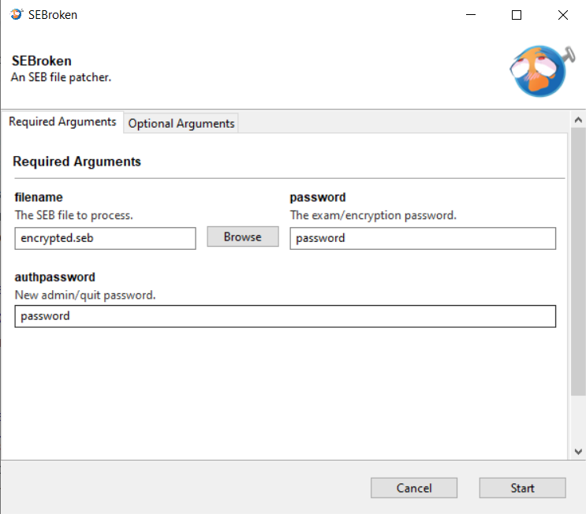

<b style="font-size:2em">An SEB file patcher.</b>
 
 <i>SEB Icon being "unlocked".</i>

# **What?**

`SEBroken` is a `.seb` file patcher, essentially, it allows you to modify certain parts of the file more easily.[^1]

## **What is an `SEB` file?**

SEB stands for [**Safe Exam Browser**](https://github.com/SafeExamBrowser).  
An SEB file is the configuration file for it, it has the extension of `.seb`.

The full file standard can be viewed [here](https://safeexambrowser.org/developer/seb-file-format.html), but basically, how a valid `.seb` file is created is by:

1. taking a [p-list](https://en.wikipedia.org/wiki/Property_list) XML file with the appropriate keys;
2. compressing the contents of it;
3. encrypting and padding it;
4. compressing it once more.

 

# **Why?**

~~My school~~ "A-certain-organization-that-I'm-currently-affiliated-with" has announced that the standard that they are going to use for an upcoming ~~finals~~ "a competency examination" is going to be changed from `Google Forms` to `Safe Exam Browser + Socrative`.

## **Wtf is that icon?**

`SEB + "Mind Broken" = SEBroken`, :pepega:

# **Running**
## **Simplified Instructions:**
Check out the advanced instructions [here](#development).
### **1. Open the `.exe` file from [releases](releases/latest).**
You should now see the following:  

### **2. Select the file you want to patch.** 
This ***has*** to be an [absolute path](https://www.computerhope.com/issues/ch001708.htm#windows).  
You can press the `Browse` button to open up a file selector.

### **3. Insert the exam password into the `password` field**
This is the encryption password, we won't be able to patch the file without it. 

### **4. (Optional) Insert a new admin password into the `authpassword` field**
If you're planning to do further modifications using the  configuration tool from SEB, you'll need to have access to the admin/quit password of the file.  

By changing the configured hash, you'll be able to log in using the newly configured password.

----

#### **Additional notes**
In `Optional Arguments` you can change a few things to do more "advanced" patches.

----

 

# **Development**
> **NOTE: Launching via this method is not recommended, YMMV.**  
> There has been found multiple blocking installation issues with [Gooey](), which is the library I used for GUI.  
> As such, if you do encounter any issues during installation, please do not consult me regarding it.   
 

When setting up the development environment, it's recommended to create a `virtualenv` first. This is to prevent dependency conflicts.  

Once you've booted into the `virtualenv`, install the requirements, and execute the `main.py` file to start up the GUI.  
(i.e. `python main.py`)

 
 
[^1] Given that you know the `encryption` password, more info in [**here**](#what-is-an-seb-file).
